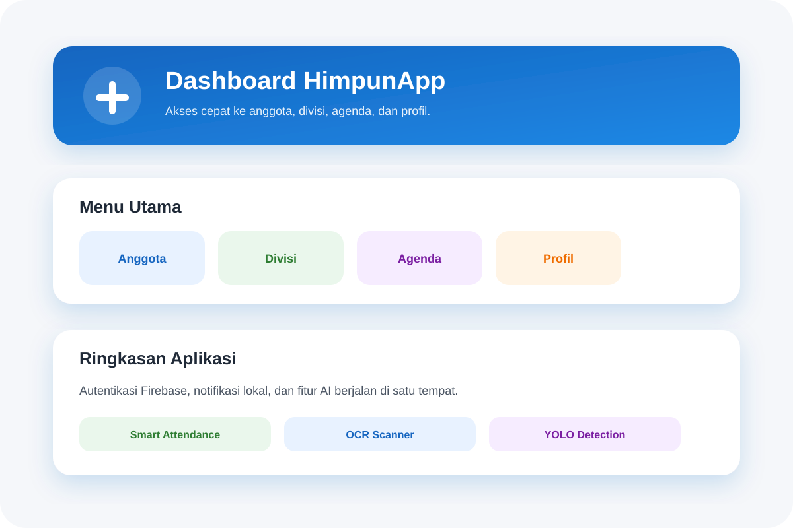
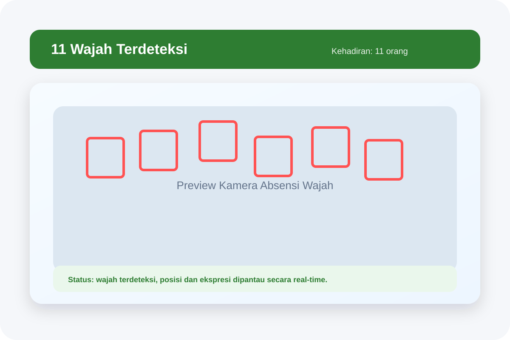
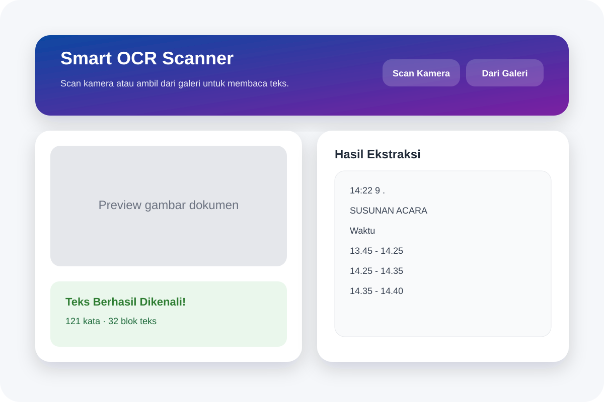

# HimpunApp AI

HimpunApp AI adalah aplikasi Flutter untuk manajemen organisasi himpunan yang dipadukan dengan fitur AI lokal. Aplikasi ini mendukung autentikasi Firebase, manajemen anggota/divisi/agenda, notifikasi, face detection untuk absensi pintar, dan OCR untuk ekstraksi teks dari gambar.

## Fitur Utama

- Autentikasi login dan registrasi berbasis Firebase.
- Dashboard organisasi dengan navigasi ke anggota, divisi, agenda, dan profil.
- Smart attendance berbasis deteksi wajah.
- OCR scanner untuk membaca teks dari kamera atau galeri.
- Model YOLO on-device untuk deteksi objek secara lokal.
- Notifikasi lokal untuk pengingat dan alur kerja aplikasi.
- Dukungan Firestore untuk penyimpanan data cloud.

## Teknologi

- Flutter
- Firebase Auth
- Cloud Firestore
- Provider
- Google ML Kit Text Recognition
- Google ML Kit Face Detection
- Ultralytics YOLO
- Flutter Local Notifications

## Preview Fitur

Gambar preview fitur disimpan di folder [image/README](image/README).

| Login | Dashboard | Face Detection | OCR Scanner |
| --- | --- | --- | --- |
|  |  |  |  |

## Struktur Aplikasi

- `lib/features/auth` untuk login dan registrasi.
- `lib/features/dashboard` untuk navigasi utama.
- `lib/features/member` untuk data anggota.
- `lib/features/division` untuk data divisi.
- `lib/features/agenda` untuk agenda kegiatan.
- `lib/features/smart_attendance` untuk absensi wajah.
- `lib/features/ocr_scanner` untuk ekstraksi teks.
- `lib/features/yolo_detection` untuk deteksi objek YOLO.

## Menjalankan Aplikasi

1. Jalankan `flutter pub get`.
2. Pastikan konfigurasi Firebase pada `lib/firebase_options.dart` dan `android/app/google-services.json` sudah sesuai.
3. Jalankan aplikasi dengan `flutter run` pada device yang didukung.

## Asset AI

Model YOLO lokal disimpan di `assets/models/yolo11n_int8.tflite` dan sudah didaftarkan di `pubspec.yaml`.
